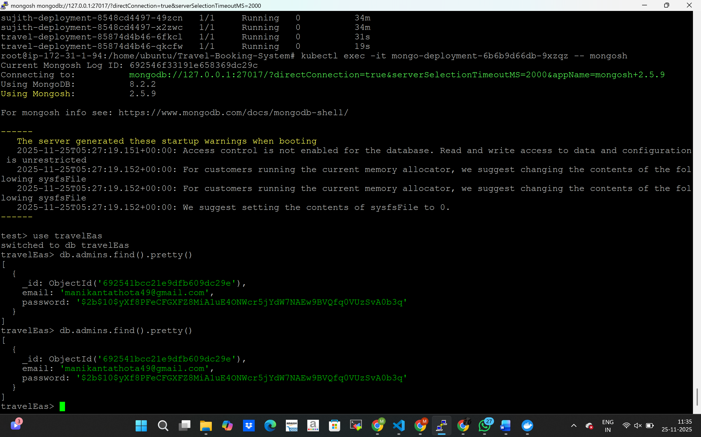
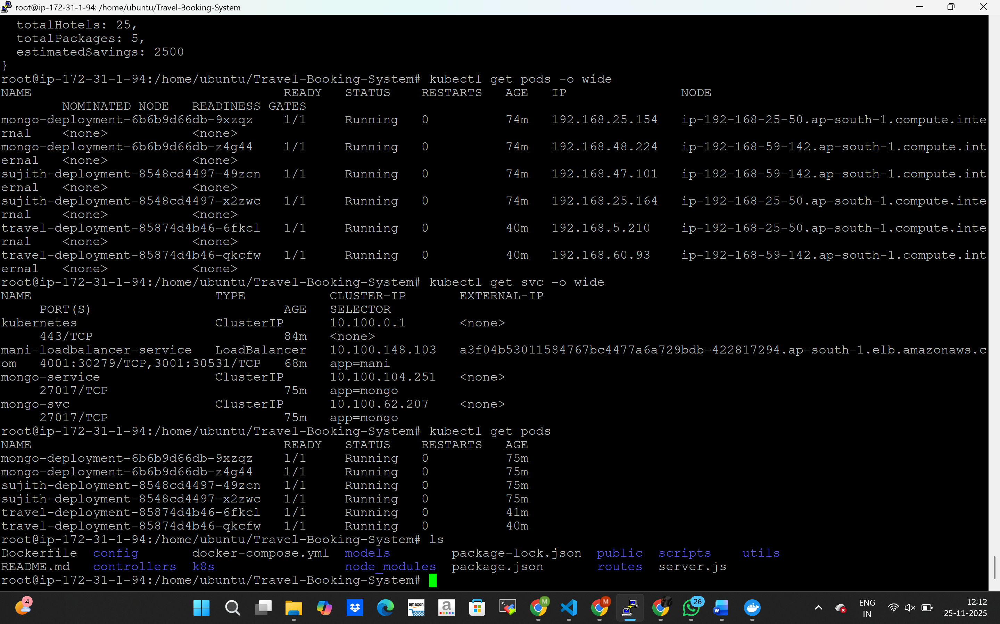
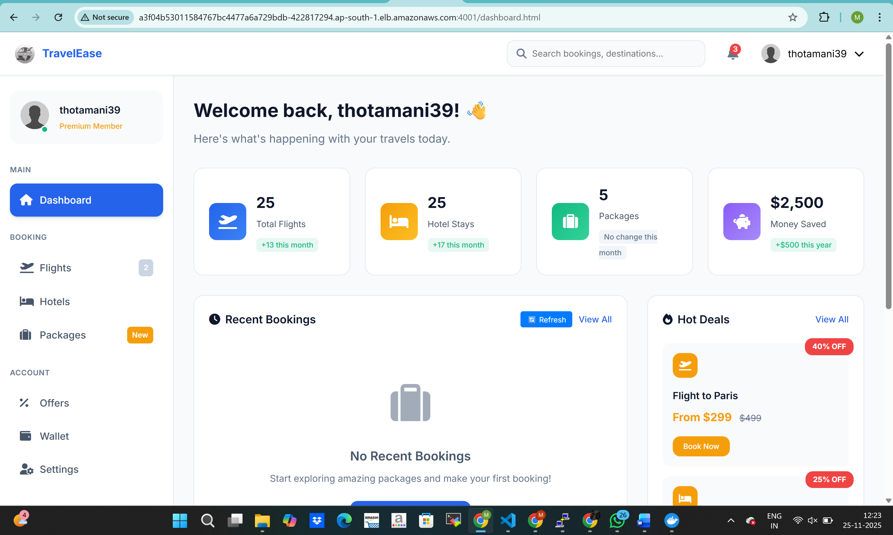

## Description
This project contains two independent web applications deployed on a Kubernetes cluster.  
Both applications are containerized using Docker and exposed externally using a single LoadBalancer service, each on a different port.  


## Folder Structure
- k8s/ → Kubernetes manifests

## Docker Hub Images
- Travel app: https://hub.docker.com/r/manikanta1432/travel-booking-image
- Sujith app: https://hub.docker.com/r/manikanta1432/sujith-project-image

## Kubernetes Setup
1. Apply manifests:
   ```bash
   kubectl apply -R -f k8s/

Travel app: https://hub.docker.com/r/manikanta1432/travel-booking-image
Sujith app: https://hub.docker.com/r/manikanta1432/sujith-project-image


# LoadBalancer URL with ports

Travel app: http://a3f04b53011584767bc4477a6a729bdb-422817294.ap-south-1.elb.amazonaws.com:4001
Sujith app: http://a3f04b53011584767bc4477a6a729bdb-422817294.ap-south-1.elb.amazonaws.com:3001


# Travel Booking System

## Screenshots

```markdown





